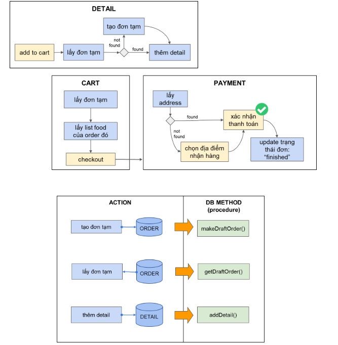
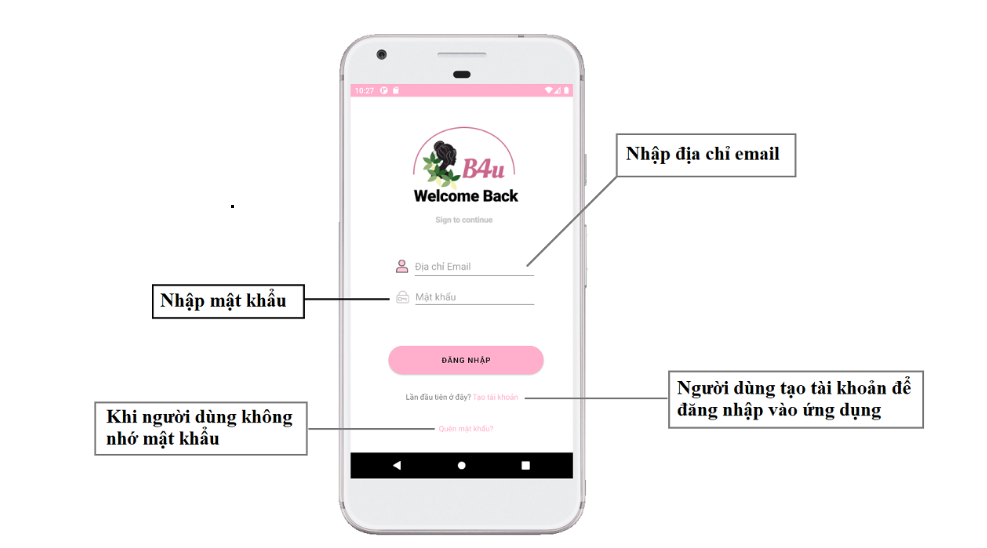
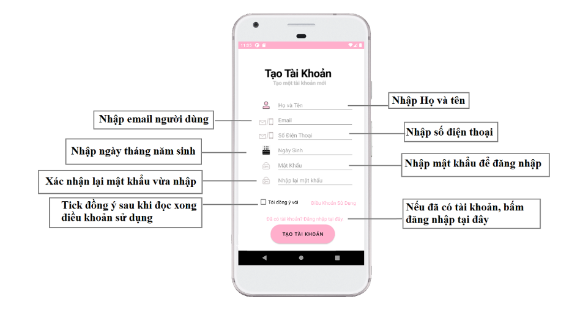

# android-b4u
Project của phát triển ứng dụng trên thiết bị di dộng
B4U
# Hình ảnh minh họa

## Sơ đồ chức năng hoạt động của app

## Login screen

## Register screen

## Home screen

## Màn hình Category

## Màn hình Chi tiết sản phẩm

